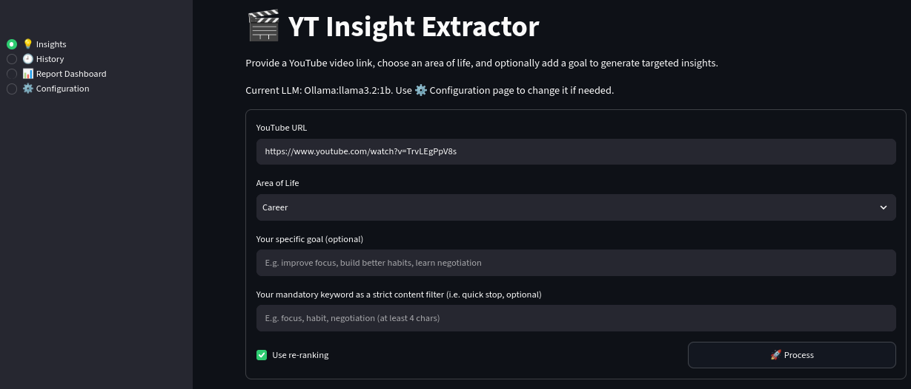
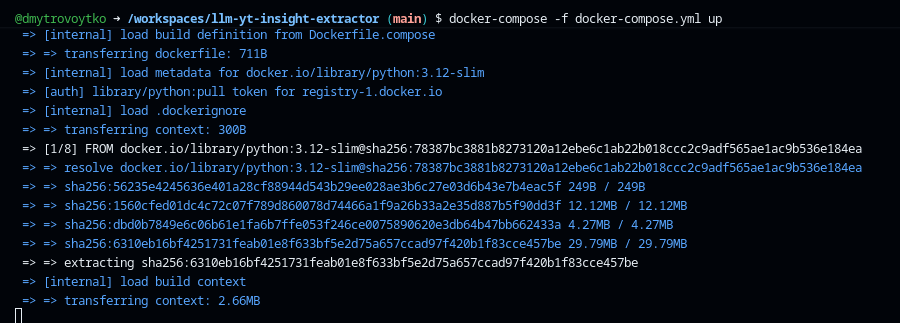
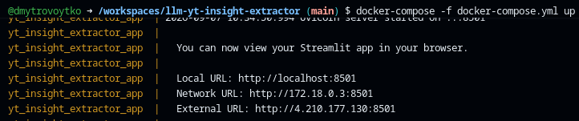
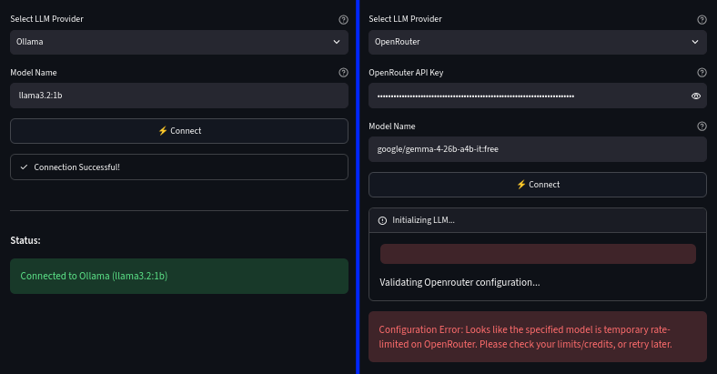
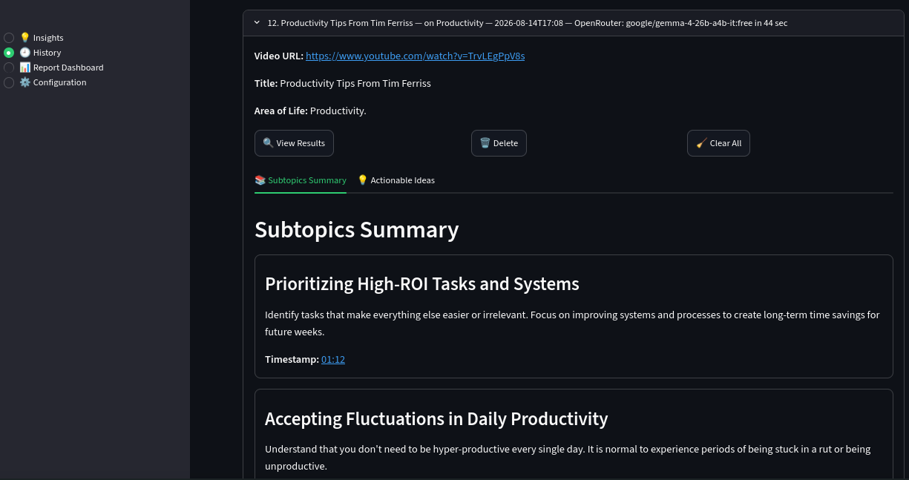
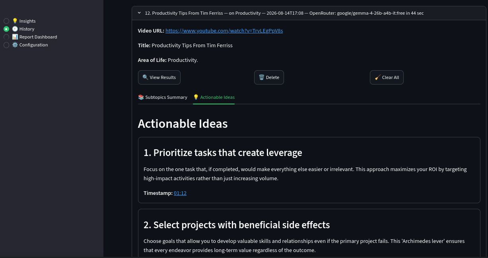
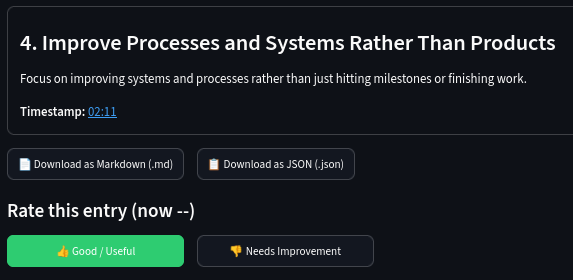
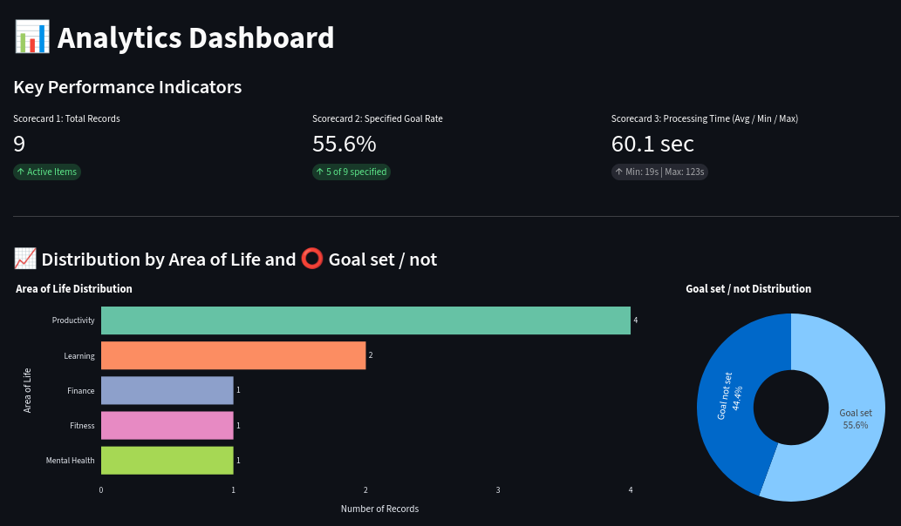
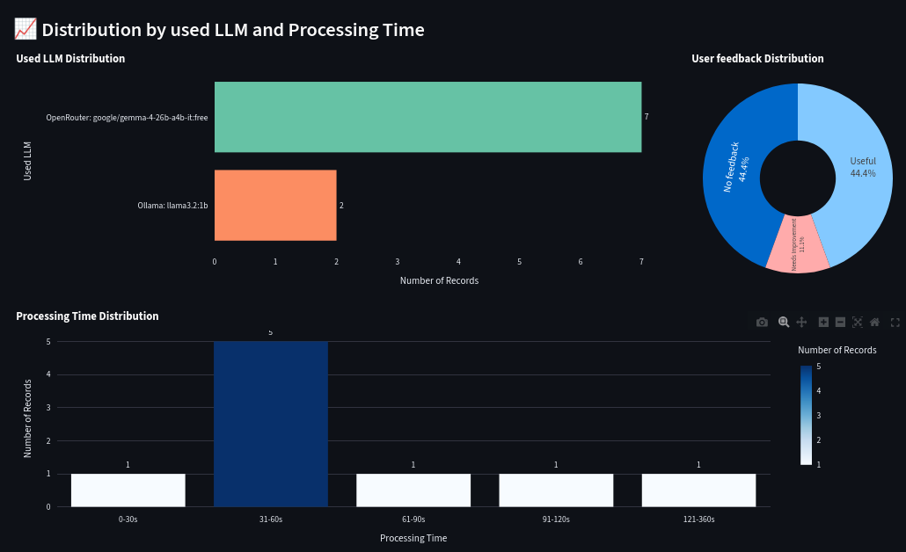

# YT Insight Extractor

**Focus your learning. Extract exactly what you need from top podcasts and turn it into a personal growth plan.**

> **TL;DR** — Paste a YouTube link, pick an Area of Life, optionally add a Goal. The app extracts the transcript, chunks it with timestamp overlap, embeds it locally (ONNX), retrieves the most relevant passages, and asks an LLM to produce a structured summary of subtopics plus a list of actionable ideas — each with a clickable YouTube timestamp.



---

## Why this project

There is an abundance of high-quality, long-form educational content on YouTube (Tim Ferriss, Andrew Huberman, Diary of a CEO, etc.). Extracting practical, personalized value from a 2-to-3-hour interview is highly inefficient: listeners with specific goals are forced to consume the whole video just to surface the few insights that apply to them.

YT Insight Extractor turns those long interviews into a small, structured set of subtopic summaries and actionable ideas, anchored to the exact moment in the video where each point was made.

> **Heads up on transcripts:** YouTube has started blocking IPs known to belong to cloud providers (AWS, GCP, Azure, etc.). If you deploy this to the cloud or make too many requests from a self-hosted box, you may see `RequestBlocked` / `IpBlocked` from `youtube-transcript-api`. Run it locally, or proxy through a residential IP.

---

## Features

- **Insights page** — staged processing UI (`extract transcript → chunk & vectorize → RAG & summarize`) with per-step status.
- Subtopic summaries and actionable ideas with **clickable YouTube timestamps** in the form `[mm:ss](https://youtu.be/...)`.
- **History** — every run is saved locally as JSON with 👍/👎 feedback per tab; view, export, or delete past results.
- **Report Dashboard** — usage KPIs: total runs, goals set, avg/min/max processing time, distributions by Area of Life, LLM, and feedback.
- **Configuration** — switch LLM provider/model at runtime (Ollama, OpenAI, Anthropic, OpenRouter — BYOK).
- **Retrieval modes** — `vector` (embeddings only, default), `keyword` (lexical overlap), or `hybrid` (reciprocal-rank fusion of both via `core/hybrid.py`, stdlib-only). Selectable in the UI; default in `core/settings.py:RETRIEVAL_MODE`.
- Optional **cross-encoder re-ranking** of retrieved chunks (UI checkbox) and a strict **mandatory-keyword** content filter.
- **Evaluated RAG + prompts** — offline retrieval eval (`scripts/eval_retrieval.py` → `docs/retrieval_eval.md`, 6 configs) and LLM prompt eval v1 vs v2 challenger (`scripts/eval_llm.py` → `docs/llm_eval.md`).
- Export results as **Markdown** or **JSON**.

---

## Architecture

```
YouTube URL
   │
   ▼
[1] Transcript extraction ── core/transcript.py
   │                         (youtube-transcript-api + pytubefix title; local cache in data/.transcript_cache/)
   ▼
[2] Timestamp chunking ───── core/chunker.py
   │                         ([mm:ss]-prefixed chunks with configurable word overlap)
   ▼
[3] Embedding ────────────── core/embedder.py + core/hf_download.py
   │                         (ONNX all-MiniLM-L6-v2 via onnxruntime/tokenizers)
   ▼
[4] In-memory vector store ─ core/rag_engine.py
   │                         (ChromaDB wrapped by llama_index.vector_stores.chroma)
   ▼
[5] Retrieval ────────────── core/rag_engine.py::retrieve(mode=...) + core/hybrid.py
   │                         mode = vector | keyword | hybrid (RRF, k=60, stdlib-only);
   │                         query = Area of Life + Goal; optional ms-marco
   │                         cross-encoder re-rank and mandatory-keyword filter
   ▼
[6] Structured generation ── core/generator.py
   │                         (Pydantic schemas + v1/v2 prompt variants from core/prompts.py;
   │                          LLM providers via core/llm_config.py)
   ▼
Results UI: subtopics & ideas tabs with clickable timestamps · history store (core/history.py) · exports (core/exports.py)
```

Each stage is a small, independently testable module under `core/`; `app.py` orchestrates them into the staged pipeline shown in the UI.

---

## :toolbox: Tech stack

- **Python:** 3.12+/3.14 tested
- **Frontend:** Streamlit
- **Transcript extraction:** `youtube-transcript-api` (Python library)
- **Vector store:** ChromaDB (in-memory, `llama_index.vector_stores.chroma`)
- **Embedding model:** `all-MiniLM-L6-v2` via `llama_index.core.embeddings`, `onnxruntime`, `tokenizers` (lightweight, no `sentence-transformers` / Torch - to make the app lightweight)
- **LLM Engine:** support of multiple providers (local, cloud) - for RAG & Summarization
- **LLM providers / models:**
  - Model must support structured outputs (JSON Schema / function calling)
  - Local: Ollama — `llama3.2:1b` (default), `granite4` family (RAG/summarization only, structured outputs often fail)
  - Cloud: OpenRouter — `google/gemma-2-9b-it:free` (default)
  - Cloud: OpenAI — `gpt-4o-mini` (default)
  - Cloud: Anthropic — `claude-3-5-sonnet-latest` (default)
- **Central configuration:** `core/settings.py` (app-wide defaults; production LLM provider/model can be overridden in the UI)
- **Framework:** LlamaIndex — simple chain, no agents (MVP scope)
- **Persistence:** local JSON history store

---

## Project structure

```
llm-yt-insight-extractor/
│
├── app.py                    # Streamlit UI, history management, export, reports
├── requirements.txt          # Pinned dependencies
├── .env.example              # Environment variables (Ollama URL, API keys, etc.)
│
├── onnx_download.py          # Fetches ONNX embedding + reranker models into models/
├── run_local.sh              # One-command local runner (Ollama + venv + Streamlit)
├── run_compose.sh            # One-command docker compose runner (Ollama + App)
├── Dockerfile                # Single-container image (runs ollama + app)
├── Dockerfile.compose        # Docker container image for docker compose
├── docker-compose.yml        # Canonical deployment: app + ollama services
├── entrypoint.sh             # Container entrypoint
├── entrypoint-compose.sh     # Container entrypoint for compose
│
├── .streamlit/
│   └── config.toml
│
├── core/
│   ├── settings.py           # App-wide settings and defaults
│   ├── transcript.py         # YouTube fetching, 60-min validation
│   ├── chunker.py            # Timestamp chunking logic with overlaps
│   ├── embedder.py           # Embedding for ChromaDB vector search
│   ├── hf_download.py        # Embedding model downloader
│   ├── rag_engine.py         # LlamaIndex index creation, retrieval (mode=vector|keyword|hybrid), synthesizer
│   ├── hybrid.py             # Stdlib-only keyword scoring + RRF fusion (k=60)
│   ├── generator.py          # LLM generation pipeline for structured output
│   ├── llm_config.py         # LLM configuration supporting multiple providers
│   ├── prompts.py            # Prompt templates v1 (production) + v2 (challenger) + version registry
│   ├── history.py            # Persistence of generated content history
│   └── exports.py            # Markdown and JSON generators
│
├── scripts/
│   ├── eval_retrieval.py     # Offline retrieval eval (6 configs → docs/retrieval_eval.md)
│   └── eval_llm.py           # Offline (+ optional live) LLM prompt eval v1 vs v2 → docs/llm_eval.md
│
├── docs/
│   ├── retrieval_eval.md     # Retrieval eval report (A–F configs, 8 queries × 6)
│   └── llm_eval.md           # LLM prompt eval report (v1 vs v2, deterministic metrics + optional judge)
│
├── tests/                    # Unittest tests for modules
│   └── test-*.py
│
├── data/
│   ├── .transcript_cache/    # Local transcript cache
│   └── history.json          # Local session history
│
├── models/                   # Local ONNX embedding + reranker files
│
└── README.md
```

---

## Quick start

### 🖥️ A. Local (Python + Ollama)

```bash
cp .env.example .env              # adjust values if needed
bash run_local.sh                 # installs/starts Ollama, creates venv, pulls model, downloads ONNX models, starts Streamlit on :8501
```

Then open http://localhost:8501.

### 🐳 B. Docker (canonical path — `docker-compose.yml`)

This is the supported Docker path. It runs the Streamlit app and Ollama as two separate services; the app talks to Ollama via the compose-internal DNS name `ollama` at `http://ollama:11434`.

```bash
cp .env.example .env              # adjust values if needed
# docker compose -f docker-compose.yml up --build
bash run_compose.sh
```





Then open http://localhost:8501.

> Project can be tested in **GitHub CodeSpaces** - the [easiest option](screenshots/docker-2.png), and free. Just  **use 4-core - 16GB RAM machine type**. 

### 🚀 Smoke test

1. Launch the app (local or Docker compose).
2. In the URL field, use the default sample: `https://www.youtube.com/watch?v=TrvLEgP8s` (a short Tim Ferriss productivity clip), or paste your variant.
3. Pick `Productivity` from **Area of Life**, leave Goal empty, click **Run**.
4. Expect ~20-90 s for the staged pipeline to complete and 3-5 subtopics to appear with clickable timestamps. Completion time depends on your compute power, otherwise use cloud provider via Configuration page.

---

## ⚙️ Configuration

All settings come from environment variables (see `.env.example`). Application-level defaults (chunking, top-k, validation thresholds) live in `core/settings.py`. The provider/model can be switched at runtime on the app's Configuration page.

| Variable | Purpose | Default |
|---|---|---|
| `USE_OLLAMA` | Consumed by `run_local.sh`: install/start Ollama and pull the model | `true` |
| `OLLAMA_HOST` | Ollama server URL (`http://ollama:11434` under docker compose) | `http://localhost:11434` |
| `OLLAMA_MODEL` | Default local model | `llama3.2:1b` |
| `OLLAMA_TIMEOUT` | Ollama request timeout (seconds) | `300` |
| `OPENAI_API_KEY` / `OPENAI_MODEL` | BYOK OpenAI access | `gpt-4o-mini` |
| `ANTHROPIC_API_KEY` / `ANTHROPIC_MODEL` | BYOK Anthropic access | `claude-3-5-sonnet-latest` |
| `OPENROUTER_API_KEY` / `OPENROUTER_MODEL` | BYOK OpenRouter access | `google/gemma-2-9b-it:free` |

Application-level toggles (in `core/settings.py`, prompt version in `core/prompts.py`; not env):

| Setting | Purpose | Default |
|---|---|---|
| `VALIDATE_DURATION` | Reject videos longer than `DURATION_TRESHOLD` upfront | `False` |
| `DURATION_TRESHOLD` | Max accepted video length (seconds) | `3600` (60 min) |
| `TOP_K_FIRST_STAGE` | First-stage vector candidates | `10` |
| `TOP_K` | Chunks kept after re-ranking | `4` |
| `RETRIEVAL_MODE` | Retrieval mode: `vector` \| `keyword` \| `hybrid` (UI selectbox overrides it) | `vector` |
| `DEFAULT_CHUNK_WORDS` | Chunk size in words | `300` |
| `DEFAULT_OVERLAP_WORDS` | Overlap between consecutive chunks | `50` |
| `USE_TRANSCRIPT_CACHE` | Cache fetched transcripts in `data/.transcript_cache/` | `True` |
| `DEFAULT_PROMPT_VERSION` (`core/prompts.py`) | Prompt variant used by `core/generator.py` (`v1` production, `v2` challenger for eval) | `v1` |

> `.env` is loaded automatically by `run_local.sh` and by `docker compose`; for manual runs, `export` the variables yourself.
> 
Web app UI configuration: choose LLM provider (successful and failed connection demo):



In app UI you can choose LLM provider (Ollama, OpenRouter, OpenAI, Anthropic). Free models on OpenRouter may be temporary rate-limited, especially evenings/weekends.

---

## Design decisions

A few notes on the trade-offs I picked, in case you're evaluating this as a portfolio piece:

- **LlamaIndex, simple chain (no agents).** The pipeline is a deterministic, six-step RAG flow with structured outputs. Agents would add latency and non-determinism without changing the deliverable. The MVP deliberately stays a chain; an agent layer is a post-MVP item.
- **In-memory ChromaDB.** Each run is short-lived, the video is small (≤ 60 min), and persistence is handled by the History store. Avoiding an on-disk vector DB removes a moving part and makes the app trivially restartable.
- **ONNX `all-MiniLM-L6-v2` over `sentence-transformers`.** The latter pulls in PyTorch, which is ~800 MB. ONNX + `tokenizers` keeps the runtime small enough to run on a CPU-only laptop and inside a container.
- **Hybrid retrieval over vector-only default.** `core/hybrid.py` (stdlib-only, no new deps) scores lexical token overlap and fuses it with the vector order via reciprocal-rank fusion (RRF, `k=60`). `RAGEngine.retrieve(mode=...)` supports `vector` (default, historical behavior), `keyword` (diagnostic re-sort of the same first-stage candidates), and `hybrid` (RRF of both). Evaluated offline in `docs/retrieval_eval.md` across 6 configs (A–F); filtered configs tie at 0.250 keyword hit rate vs 0.031 unfiltered, so `vector` stays the default and `hybrid` is one UI click away.
- **Cross-encoder re-ranking is opt-in.** It measurably improves relevance on noisy transcripts but adds ~1-2 s per query and another model download. Toggled via the UI checkbox (off by default), then applied inside `RAGEngine.rerank()`.
- **Mandatory-keyword filter.** A safety net for the rare case where vector retrieval returns a chunk that doesn't actually contain the user's chosen Area of Life term. Stops obviously off-topic context from reaching the LLM. The eval shows it is the single biggest relevance lever (0.031 → 0.250 hit rate).
- **Local-first default (`llama3.2:1b`).** It's the smallest model I've found that consistently honors the JSON-Schema output the pipeline requires. IBM Granite models are great for free-form summarization but their structured-output adherence is unreliable as of writing.

---

## How it works

1. **Extract transcript** via `youtube-transcript-api`; cache by video ID in `data/.transcript_cache/`.
2. **Chunk** into `[mm:ss]`-prefixed blocks (`DEFAULT_CHUNK_WORDS`, `DEFAULT_OVERLAP_WORDS`).
3. **Embed** chunks with ONNX `all-MiniLM-L6-v2`; build an in-memory ChromaDB index.
4. **Retrieve** `TOP_K_FIRST_STAGE` first-stage candidates, then order by `RETRIEVAL_MODE` (`vector` similarity, `keyword` overlap, or `hybrid` RRF of both); optionally cross-encoder re-rank to `TOP_K` and apply the mandatory-keyword filter.
5. **Generate** structured output (Pydantic schemas + `v1` production prompt from `core/prompts.py`; `v2` challenger exists for eval only); stream results into the two UI tabs.
6. **Persist** the run (transcript length, timing breakdown, model used, feedback buttons) to `data/history.json`.

---

## Sample output

After a successful run, the History page shows a row like:

| Field | Example |
|---|---|
| Video ID | `TrvLEgP8s` |
| Area of Life | `Productivity` |
| Goal | (empty) |
| LLM | `Ollama: llama3.2:1b` |
| Total time | `28.4 s` |
| Subtopics | 4 |
| Actionable ideas | 5 |
| Feedback | 👍 / 👎 / unset |







## 📊 Report Dashboard

The Report Dashboard aggregates these across runs.





---

## Evaluation

Retrieval and prompts are evaluated offline on cached transcripts — no YouTube calls, no running LLM required. Reports are checked in under `docs/`.

**Retrieval (`scripts/eval_retrieval.py` → [`docs/retrieval_eval.md`](docs/retrieval_eval.md))** — 8 queries × 6 configs (48 rows) on `TrvLEgPpV8s` (7 chunks), same chunking and `top_k=4` throughout:

| Config | Keyword hit rate | Timestamp valid | Diversity |
|---|---:|---:|---:|
| A: vector-only | 0.031 | 0.250 | 0.875 |
| B: vector + rerank | 0.031 | 0.250 | 0.875 |
| C: vector + rerank + kw filter (production default) | **0.250** | 0.188 | 0.887 |
| D: keyword + kw filter | 0.250 | 0.188 | 0.887 |
| E: hybrid + kw filter | 0.250 | 0.188 | 0.887 |
| F: hybrid + rerank + kw filter | 0.250 | 0.188 | 0.887 |

Takeaway: the keyword filter is the dominant lever (0.031 → 0.250); hybrid ties C on the TF stand-in and stays available via the UI mode selector. Re-run with `python scripts/eval_retrieval.py --cache-id <VIDEO_ID>` (add `--use-production` for live embeddings when deps + models are present).

**LLM prompts (`scripts/eval_llm.py` → [`docs/llm_eval.md`](docs/llm_eval.md))** — v1 (production) vs v2 (challenger: focus-area emphasis for subtopics, mandatory first-step for ideas). Offline mode re-scores recent `data/history.json` entries on `json_valid_rate`, `count_in_range_rate`, `timestamp_valid_rate`, `avg_keyword_coverage`, `first_step_rate`; live mode (`--with-llm`) regenerates with both prompts, plus optional LLM-as-a-judge (`--judge` via `EVALUATION_LLM` in `core/settings.py`). v1 stays the default (`DEFAULT_PROMPT_VERSION = "v1"`); the v1 contract is pinned by `tests/test_prompts_versions.py`.

```bash
python scripts/eval_retrieval.py --cache-id TrvLEgPpV8s
python scripts/eval_llm.py --samples 5
python scripts/eval_llm.py --with-llm --judge   # needs deps + running LLM
```

---

## Testing

Run the full suite:

```bash
python -m unittest discover -s tests/
```

Or a single module, for example:

```bash
python -m unittest tests/test_llm_config.py
```

---

## FAQ / Troubleshooting

- **"My IP gets blocked when fetching transcripts."** YouTube rate-limits / blocks IPs that look like cloud providers. Run locally, or proxy through a residential IP. Cached transcripts in `data/.transcript_cache/` are reused.
- **"I get a 404 / model-not-found on the default cloud model."** Cloud providers rotate model names. Check `.env.example` for the current defaults; this README tracks the same values.
- **"How do I enable the 60-minute video cap?"** Set `VALIDATE_DURATION = True` in `core/settings.py`. The PRD defines the cap; the MVP ships with it off so longer videos can still be processed for testing.
- **"How do I use a different embedding or reranker model?"** Update `DEFAULT_EMBEDDING_MODEL` / `DEFAULT_RERANKING_MODEL` in `core/settings.py` and re-run `python onnx_download.py`. If the model is gated on the Hugging Face Hub, also set `HF_API_KEY` / `HUGGINGFACE_API_KEY` in `.env`.
- **"Ollama times out on the first run."** The first request to a freshly-pulled model includes model load time. Increase `OLLAMA_TIMEOUT` (default `180`).
- **"How can I get free OpenRouter API access?"** Go to openrouter.ai. Sign up and create your account using your email, GitHub, or Google account. Get a free API key at https://openrouter.ai/keys.
- **"I'm getting `(title not extracted) TrvLEgPpV8s` instead of title."** YouTube is changing API used to extract video data, and blocking IPs known to belong to cloud providers as they run similar apps scraping their video data. Try running the app locally. Use several cached transcripts and provided history.json to test application.

---

## Roadmap

**Lessons learned so far**
- The structured-output requirement is the single biggest constraint on model choice. "Free-form summarization" and "structured summarization" are two very different problems for small local models.
- Cross-encoder re-ranking helps most on long, topically diverse transcripts; for short clips the marginal gain rarely justifies the latency.

**Next steps**
- ~~Add an **LLM-as-a-Judge** evaluation flow~~ — done offline (`scripts/eval_llm.py`, `--judge` flag wired to `EVALUATION_LLM`); remaining: run a live `--with-llm --judge` pass and promote the winner - requires more time, and credits.
- ~~Expreriment with other **challenger prompt** alongside the production prompt~~: live comparison + admin A/B view.
- ~~Evaluate retrieval (vector vs rerank vs hybrid)~~: live-embedding check that hybrid beats `vector` on a larger sample.
- Test more lightweight Ollama models (e.g., newer Granite, Gemma-4) against `llama3.2:1b` on structured outputs.

---

## Contributing

Fork → branch → PR. Please add or update tests in `tests/` for any change to `core/`. Before opening a PR, run `python -m unittest discover -s tests/` and make sure it passes.

---

## Support

If you hit an issue following these instructions (or something is unclear), please open an [Issue](/issues) — feedback, questions, and suggestions are welcome. PRs are also encouraged.

If you find this project helpful, your ⭐️star⭐️ on [the repo](https://github.com/dmytrovoytko/llm-yt-insight-extractor) helps others discover it. Thank you! 🙏

Made with ❤️ in Ukraine 🇺🇦 by Dmytro Voytko.
